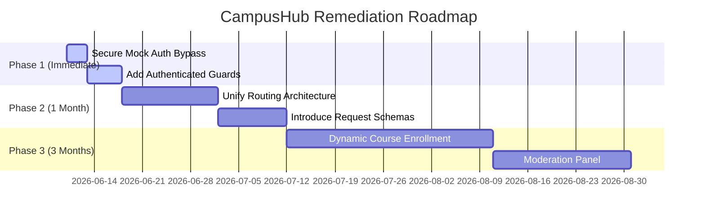

# CampusHub Project Forensic Analysis Report

This document presents a comprehensive, itemized forensic analysis of the CampusHub software application based on a recursive evaluation of the complete repository source code.

---

## Phase 1: Project Scan

### 1. Project Folder Tree
```text
campushub-swe-lab/
├── .env.example
├── .gitignore
├── eslint.config.js
├── index.html
├── package-lock.json
├── package.json
├── README.md
├── vercel.json
├── vite.config.js
├── api/
│   ├── alumni/
│   │   └── index.js
│   ├── assistant/
│   │   └── index.js
│   ├── auth/
│   │   └── index.js
│   ├── clubs/
│   │   └── index.js
│   ├── dashboard/
│   │   └── index.js
│   ├── jobs/
│   │   └── index.js
│   ├── live-classes/
│   │   └── index.js
│   ├── notices/
│   │   └── index.js
│   ├── profile/
│   │   └── index.js
│   ├── scholarships/
│   │   └── index.js
│   ├── settings/
│   │   └── index.js
│   └── tests/
│       └── index.js
├── lib/
│   ├── authHandler.js
│   ├── connectMongo.js
│   └── firebaseAdmin.js
├── public/
│   ├── favicon.svg
│   └── icons.svg
├── server/
│   ├── firebaseAdmin.js
│   ├── index.js
│   ├── package-lock.json
│   ├── package.json
│   ├── db/
│   │   └── connectMongo.js
│   ├── middleware/
│   │   └── auth.js
│   ├── models/
│   │   ├── AlumniProfile.js
│   │   ├── AssistantMessage.js
│   │   ├── Club.js
│   │   ├── DashboardHome.js
│   │   ├── FacultyUser.js
│   │   ├── Job.js
│   │   ├── JobApplication.js
│   │   ├── LiveClass.js
│   │   ├── MockTest.js
│   │   ├── Notice.js
│   │   ├── ProfilePage.js
│   │   ├── Scholarship.js
│   │   ├── ScholarshipApplication.js
│   │   ├── SettingsPage.js
│   │   ├── StudentUser.js
│   │   ├── TestAttempt.js
│   │   └── UserProfile.js
│   ├── routes/
│   │   ├── auth.js
│   │   ├── dashboard.js
│   │   ├── faculty.js
│   │   └── notices.js
│   └── seed/
│       ├── facultyUsersSeed.js
│       ├── seedDashboardData.js
│       ├── seedDemoData.js
│       ├── seedFirebaseUsers.js
│       └── studentUsersSeed.js
└── src/
    ├── App.css
    ├── App.jsx
    ├── firebase.js
    ├── index.css
    ├── main.jsx
    ├── assets/
    │   ├── hero.png
    │   ├── react.svg
    │   └── vite.svg
    ├── components/
    │   └── RequireRole.jsx
    ├── hooks/
    │   └── useProfile.js
    ├── layouts/
    │   └── DashboardLayout.jsx
    └── pages/
        ├── Auth.jsx
        ├── Landing.jsx
        └── dashboard/
            ├── AdminHome.jsx
            ├── Alumni.jsx
            ├── Assistant.jsx
            ├── Clubs.jsx
            ├── Courses.jsx
            ├── FacultyCourses.jsx
            ├── FacultyHome.jsx
            ├── Home.jsx
            ├── JobBoard.jsx
            ├── LiveClasses.jsx
            ├── Messages.jsx
            ├── MockTests.jsx
            ├── NotesLibrary.jsx
            ├── NoticeBoard.jsx
            ├── Profile.jsx
            ├── Scholarships.jsx
            ├── SectionPage.jsx
            └── Settings.jsx
```

### 2. File Count Summary
*   **Total Source Files analyzed:** 89 (excluding `.git` internals)
    *   **Root Configuration Files:** 9
    *   **Serverless API Handlers (`api/`):** 12
    *   **Shared Backend Libs (`lib/`):** 3
    *   **Frontend Shared Code (`src/` excluding pages/dashboard):** 10
    *   **Frontend Dashboard Pages (`src/pages/dashboard/`):** 18
    *   **Frontend Page Modules (`src/pages/`):** 2
    *   **Backend Server Modules (`server/`):** 31
    *   **Static Assets (`public/`):** 2

### 3. Technology Stack & Frameworks
*   **Frontend Library:** React 19.2.5
*   **Build & Dev Server:** Vite 8.0.10
*   **Routing:** React Router DOM 7.14.2
*   **Database:** MongoDB via Mongoose 9.6.1 ORM
*   **Authentication & Authorization:** Firebase Authentication Client SDK (`firebase` v12.12.1) & Firebase Admin SDK (`firebase-admin` v12.1.1)
*   **Backend Server Environment:** Node.js Express 4.19.2 (or serverless mode using Vercel routes)
*   **Deployment Architecture:** Configured for Vercel deployment (serverless rewriting routes mapped in `vercel.json` to individual handlers under `/api`).

### 4. Shared Libraries
*   `cors` - Cross-Origin Resource Sharing middleware.
*   `dotenv` - Loads variables from `.env` files.

### 5. Authentication & Authorization
*   **Authentication:** Dual support for real Firebase ID tokens and mock authentication bypass tokens (tokens prefixed with `mock-` matching student emails).
*   **Authorization:** Custom middleware (`requireRole`) validating roles against a user profile schema. Valid roles: `student`, `faculty`, `admin`.

### 6. State Management
*   Local Component States (`useState`) synced with custom state propagation hooks (`useProfile`) that hook directly into Firebase's `onAuthStateChanged` auth listener.

---

## Phase 2: Page & Route Analysis

The table below outlines the route structure, file layout, user interfaces, features, and API transactions.

| Page Name | Route URL | File Location | Purpose | Core Features |
| :--- | :--- | :--- | :--- | :--- |
| **Landing** | `/` | [Landing.jsx](file:///E:/Apps/CampusHub_Soft/campushub-swe-lab/src/pages/Landing.jsx) | Platform introduction & guest onboarding | Hero animations, stats grids, feature cards, links to authentication modes |
| **Authentication** | `/auth` | [Auth.jsx](file:///E:/Apps/CampusHub_Soft/campushub-swe-lab/src/pages/Auth.jsx) | Registration and login portal | Google Sign-in, email/password validation, automatic mock bypass login |
| **Student Home** | `/dashboard` (Student) | [Home.jsx](file:///E:/Apps/CampusHub_Soft/campushub-swe-lab/src/pages/dashboard/Home.jsx) | Primary student hub | Course progress bar tracker, notice sidebar list, upcoming academic schedules |
| **Faculty Home** | `/dashboard` (Faculty) | [FacultyHome.jsx](file:///E:/Apps/CampusHub_Soft/campushub-swe-lab/src/pages/dashboard/FacultyHome.jsx) | Instructor overview page | Teaching courses lists, lecture timetables, quick notices shortcut |
| **Admin Home** | `/dashboard` (Admin) | [AdminHome.jsx](file:///E:/Apps/CampusHub_Soft/campushub-swe-lab/src/pages/dashboard/AdminHome.jsx) | Admin panel controls | System health monitoring card, activity timeline feeds, administrator actions |
| **Student Courses**| `/dashboard/courses` (Student) | [Courses.jsx](file:///E:/Apps/CampusHub_Soft/campushub-swe-lab/src/pages/dashboard/Courses.jsx) | Student course catalog | Dynamic search filter, custom course cards |
| **Faculty Courses**| `/dashboard/courses` (Faculty) | [FacultyCourses.jsx](file:///E:/Apps/CampusHub_Soft/campushub-swe-lab/src/pages/dashboard/FacultyCourses.jsx) | Instructor syllabus portal | Quick buttons for managing coursework and student list viewing |
| **Notice Board** | `/dashboard/notice-board` | [NoticeBoard.jsx](file:///E:/Apps/CampusHub_Soft/campushub-swe-lab/src/pages/dashboard/NoticeBoard.jsx) | Campus announcements board | Category tab filtering (Holiday, Exams, etc.), search field |
| **Notes Library** | `/dashboard/notes-library` | [NotesLibrary.jsx](file:///E:/Apps/CampusHub_Soft/campushub-swe-lab/src/pages/dashboard/NotesLibrary.jsx) | Peer shared study notes | Search index, subject category listing sidebar, note detail reviews |
| **Messages** | `/dashboard/messages` | [Messages.jsx](file:///E:/Apps/CampusHub_Soft/campushub-swe-lab/src/pages/dashboard/Messages.jsx) | Academic direct messaging UI | Sidebar threads list, search bar, hardcoded direct chat layout |
| **Profile** | `/dashboard/profile` | [Profile.jsx](file:///E:/Apps/CampusHub_Soft/campushub-swe-lab/src/pages/dashboard/Profile.jsx) | Student transcript and advisor information | Academic stats card (CGPA, balance), GPA semester charts, advisor profile card |
| **Clubs** | `/dashboard/club` | [ClubsPage.jsx](file:///E:/Apps/CampusHub_Soft/campushub-swe-lab/src/pages/dashboard/Clubs.jsx) | Extra-curricular community portal | Grid showing club summary, dynamic join triggers |
| **Job Board** | `/dashboard/job-board` | [JobBoard.jsx](file:///E:/Apps/CampusHub_Soft/campushub-swe-lab/src/pages/dashboard/JobBoard.jsx) | Placements, internships, and careers board | Filters for career type (Internship, Full-time), inline applications |
| **Mock Tests** | `/dashboard/mock-tests` | [MockTests.jsx](file:///E:/Apps/CampusHub_Soft/campushub-swe-lab/src/pages/dashboard/MockTests.jsx) | Assessment center | Self-evaluation metrics, test details grid, exam entry triggers |
| **Live Classes** | `/dashboard/live-classes` | [LiveClasses.jsx](file:///E:/Apps/CampusHub_Soft/campushub-swe-lab/src/pages/dashboard/LiveClasses.jsx) | Virtual lecture classrooms | Ongoing lecture grid, schedule timetable, live session connection link |
| **AI Assistant** | `/dashboard/ai-assistant` | [Assistant.jsx](file:///E:/Apps/CampusHub_Soft/campushub-swe-lab/src/pages/dashboard/Assistant.jsx) | Chatbot interface | Quick-select conceptual prompt buttons, AI conversation logs |
| **Alumni Network** | `/dashboard/alumni` | [Alumni.jsx](file:///E:/Apps/CampusHub_Soft/campushub-swe-lab/src/pages/dashboard/Alumni.jsx) | Graduates directory | Search indexing, custom profile cards, mentorship request triggers |
| **Scholarships** | `/dashboard/scholarships` | [Scholarships.jsx](file:///E:/Apps/CampusHub_Soft/campushub-swe-lab/src/pages/dashboard/Scholarships.jsx) | Grant index portal | Criteria summaries, category filter, application submission trigger |
| **Settings** | `/dashboard/settings` | [Settings.jsx](file:///E:/Apps/CampusHub_Soft/campushub-swe-lab/src/pages/dashboard/Settings.jsx) | Preferences editor | Profile detail editor, notifications, theme toggles |

---

## Phase 3: Button & Click-Handler Analysis

Below is a detailed map of active user buttons across the client code:

| Component File | Button Text / Label | Click Handler Function / Inline | API Endpoint Invoked | Navigation / Result |
| :--- | :--- | :--- | :--- | :--- |
| **Landing.jsx** | "Get Started" | `() => navigate('/auth', { state: { mode: 'login' } })` | *None* | Navigates to `/auth` in login view |
| **Landing.jsx** | "Join Community" | `() => navigate('/auth', { state: { mode: 'signup' } })` | *None* | Navigates to `/auth` in signup view |
| **Landing.jsx** | "Start Earning Today" | `() => navigate('/auth', { state: { mode: 'signup' } })` | *None* | Navigates to `/auth` in signup view |
| **Landing.jsx** | "Join CampusHub Now" | `() => navigate('/auth', { state: { mode: 'signup' } })` | *None* | Navigates to `/auth` in signup view |
| **Auth.jsx** | "Continue with Google" | `handleGoogleLogin` | `POST /api/auth/register` (signup mode) or `/api/auth/login` (login mode) | Navigates to `/dashboard` upon success |
| **Auth.jsx** | "Sign In" | `handleLogin` (via form submission) | `POST /api/auth/login` | Bypasses auth if email contains `@campushub.edu` and routes to `/dashboard` |
| **Auth.jsx** | "Create Account" | `handleSignup` (via form submission) | `POST /api/auth/register` | Routes to `/dashboard` upon verification |
| **Auth.jsx** | "Sign Up" / "Sign In" | `() => setAuthMode('signup' / 'login')` | *None* | Toggles authentication mode state |
| **Auth.jsx** | "Back to Home" | `() => navigate('/')` | *None* | Redirects to home page `/` |
| **DashboardLayout.jsx**| Profile Card Footer | `() => navigate('/dashboard/profile')` | *None* | Navigates to student profile page |
| **DashboardLayout.jsx**| "Logout" | `handleLogout` | *None* | Calls Firebase `signOut()`, deletes session, routes to `/auth` |
| **Alumni.jsx** | "Request Mentorship" | `() => handleRequest(profile._id)` | `POST /api/alumni/request` | Submits candidate profile reference to server |
| **Alumni.jsx** | Filter tags | `() => setActiveFilter(item)` | *None* | Toggles search filter |
| **Assistant.jsx** | "Send" | `handleSend` | `POST /api/assistant` | Submits message draft, appends user chat message in UI |
| **Clubs.jsx** | "Join" | `() => handleJoin(clubId)` | `POST /api/clubs/join` | Increments member count inside database |
| **JobBoard.jsx** | "Apply Now" | `() => handleApply(job._id)` | `POST /api/jobs/apply` | Generates a new `JobApplication` entry |
| **JobBoard.jsx** | "View Details" | `() => alert(...)` | *None* | Triggers browser detail alert |
| **LiveClasses.jsx** | "Join Now" | `() => handleJoin(liveNow._id)` | `POST /api/live-classes/join` | Increments class attendee counter |
| **MockTests.jsx** | "Start Test" | `() => handleStart(testId)` | `POST /api/tests/start` | Creates `TestAttempt` document |
| **Scholarships.jsx** | "Apply Now" | `() => handleApply(item._id)` | `POST /api/scholarships/apply` | Creates `ScholarshipApplication` document |
| **Scholarships.jsx** | "More Details" | `() => alert(...)` | *None* | Displays alert with criteria |
| **Scholarships.jsx** | "Save for Later" | `() => alert(...)` | *None* | Displays bookmark notification |
| **Settings.jsx** | "Save Changes" | `handleSave` | `POST /api/settings` | Updates setting configurations |

---

## Phase 4: Form Auditing & Validation

### 1. Authentication Form
*   **Path:** `src/pages/Auth.jsx`
*   **Fields:**
    *   `fullName` (String, required during signup)
    *   `email` (String, required, email type validation)
    *   `password` (String, required)
    *   `remember` (Boolean, local layout checkbox)
*   **Validation:** HTML5 native input enforcement. No complex length checking is performed client-side.
*   **Submission Flow:** Bypasses authentication if email contains `@campushub.edu` (storing `campushub_mock_token` value `mock-<email>` in LocalStorage). For standard users, authenticates via Firebase Auth, extracts the ID token, and sends it to the server.
*   **Database impact:** Upserts user record inside MongoDB `UserProfile` table.

### 2. Profile Details Form
*   **Path:** `src/pages/dashboard/Settings.jsx`
*   **Fields:**
    *   `fullName` (String, binds to settings state)
    *   All other profile inputs (Student ID, Email, Phone, Dept, Bio) are marked `readOnly`.
*   **Submission Flow:** Posting changes to `/api/settings` updates configurations where `key` is `default`.

---

## Phase 5: API Endpoint Reference

The system endpoints (supported in Express and Serverless versions):

### 1. Verification API
*   **`POST /api/auth/login`**
    *   **Auth Required:** No
    *   **Body:** `{ idToken: "..." }`
    *   **Success Response (200):** `{ message: "Login verified", user: { uid, email, name, role, profile: { ... } } }`
    *   **Internal Logic:** Checks if token starts with `mock-`. If so, uses a mock profile; otherwise, verifies via Firebase Admin Cert certificate.
*   **`POST /api/auth/register`**
    *   **Auth Required:** No
    *   **Body:** `{ idToken: "..." }`
    *   **Success Response (201):** `{ message: "Registration verified", user: { ... } }`
*   **`GET /api/auth/me`**
    *   **Auth Required:** Yes (Bearer Token in Header)
    *   **Success Response (200):** `{ user: { ... } }`

### 2. notices API
*   **`GET /api/notices`**
    *   **Auth Required:** Yes (Bearer Token)
    *   **Query Params:** `category`, `q` (Search Query)
    *   **Success Response (200):** `{ notices: [ ... ], count: X, role: "student" }`
*   **`POST /api/notices`**
    *   **Auth Required:** Yes
    *   **Body:** `{ title, body, category, priority, audienceRoles, publishAt }`
    *   **Success Response (211):** `{ notice: { ... } }`
    *   **Role Constraint:** Only `faculty` or `admin` accounts are allowed.

### 3. Student Catalog API
*   **`GET /api/dashboard/home`**
    *   **Auth Required:** No
    *   **Query Params:** `email`
    *   **Success Response (200):** Returns custom metrics, notices list, and events list based on matched `UserProfile` or `StudentUser` email. Falls back to default JSON templates if query is absent.
*   **`GET /api/dashboard/students`**
    *   **Auth Required:** No
    *   **Success Response (200):** `{ students: [...], count, source }`

### 4. Extra-Curricular / Careers / Mock / Live API
*   **`GET /api/alumni`** / `POST /api/alumni` / `POST /api/alumni/request` (Mentorship submission request)
*   **`GET /api/clubs`** / `POST /api/clubs` / `POST /api/clubs/join` (Increments member counts)
*   **`GET /api/jobs`** / `POST /api/jobs` / `POST /api/jobs/apply` (Generates application entry)
*   **`GET /api/live-classes`** / `POST /api/live-classes` / `POST /api/live-classes/join` (Increments attendee count)
*   **`GET /api/scholarships`** / `POST /api/scholarships` / `POST /api/scholarships/apply` (Creates application entry)
*   **`GET /api/tests`** / `POST /api/tests` / `POST /api/tests/start` (Registers a test attempt)
*   **`GET /api/assistant`** / `POST /api/assistant` (Submits a message and returns response)

---

## Phase 6: Database Architecture & Relations

MongoDB collection designs utilizing Mongoose Schemas:

### 1. Schema Definitions

#### `UserProfile`
```javascript
{
  uid: { type: String, required: true, unique: true, index: true },
  email: { type: String, required: true, unique: true, index: true },
  fullName: { type: String, required: true },
  role: { type: String, enum: ['student', 'faculty', 'admin'], default: 'student', index: true },
  department: { type: String, default: '' },
  year: { type: String, default: '' },
  semester: { type: String, default: '' },
  gpa: { type: Number, default: 0 },
  status: { type: String, default: 'active' },
  avatarUrl: { type: String, default: '' },
  dashboardMeta: {
    noticesUnread: { type: Number, default: 0 },
    messagesUnread: { type: Number, default: 0 },
    coursesEnrolled: { type: Number, default: 0 }
  }
}
```

#### `StudentUser`
*   Contains identical field mappings to `UserProfile` but utilizes `studentId` instead of `uid`. Maintained for legacy compatibility during sync updates.

#### `FacultyUser`
```javascript
{
  uid: { type: String, required: true, unique: true, index: true },
  email: { type: String, required: true, unique: true, index: true },
  fullName: { type: String, required: true },
  role: { type: String, default: 'faculty', index: true },
  department: { type: String, default: '' },
  designation: { type: String, default: '' },
  officeLocation: { type: String, default: '' },
  contactInfo: { type: String, default: '' },
  avatarUrl: { type: String, default: '' }
}
```

#### `Notice`
```javascript
{
  title: { type: String, required: true },
  body: { type: String, required: true },
  category: { type: String, enum: ['Exam', 'Holiday', 'Event', 'General'], default: 'General', index: true },
  priority: { type: String, enum: ['High', 'Medium', 'Low'], default: 'Medium', index: true },
  audienceRoles: { type: [String], default: ['student', 'faculty', 'admin'], index: true },
  publishAt: { type: Date, default: Date.now, index: true },
  createdBy: {
    uid: { type: String, default: '' },
    email: { type: String, default: '' },
    name: { type: String, default: '' }
  }
}
```

#### `Club`
```javascript
{
  name: { type: String, required: true },
  summary: { type: String, default: '' },
  date: { type: String, default: '' },
  time: { type: String, default: '' },
  venue: { type: String, default: '' },
  description: { type: String, default: '' },
  coverImage: { type: String, default: '' },
  memberCount: { type: Number, default: 0 },
  tags: { type: [String], default: [] }
}
```

#### `Job` & `JobApplication`
*   `Job`: Fields for title, company, description, type, location, salaryRange, deadline, tags, isFeatured.
*   `JobApplication`: Binds `jobId` (ObjectId, ref `Job`), name, email, resumeUrl, status (default: `'submitted'`).

#### `Scholarship` & `ScholarshipApplication`
*   `Scholarship`: Fields for title, provider, description, amount, type, deadline, eligibility, categories, countries.
*   `ScholarshipApplication`: Binds `scholarshipId` (ObjectId, ref `Scholarship`), name, email, status.

#### `MockTest` & `TestAttempt`
*   `MockTest`: Title, courseCode, questions count, durationMinutes, difficulty, avgScore, participants.
*   `TestAttempt`: Binds `testId` (ObjectId, ref `MockTest`), name, score (default: `0`), status (default: `'started'`).

#### `DashboardHome` & `ProfilePage` & `SettingsPage`
*   Configured configuration records mapped by a unique `key` query field value (typically `'default'` or `'home'`).

---

### 2. Entity-Relationship (ER) Model (Text Diagram)

```text
  +------------------+             +------------------------+
  |    UserProfile   |             |       JobApplication   |
  +------------------+             +------------------------+
  | PK: uid          |             | PK: _id                |
  | email (Unique)   |             | FK: jobId ------------+ |
  | role             |             | name, email            | |
  +------------------+             +------------------------+ |
                                                            | |
  +------------------+             +------------------------+ |
  |   FacultyUser    |             |          Job           | |
  +------------------+             +------------------------+ |
  | PK: uid          |             | PK: _id <--------------+ |
  | email (Unique)   |             | title, company         |
  +------------------+             +------------------------+

  +------------------+             +------------------------+
  |    Scholarship   |             | ScholarshipApplication |
  +------------------+             +------------------------+
  | PK: _id <--------+-------------| PK: _id                |
  | title, provider  |             | FK: scholarshipId      |
  +------------------+             +------------------------+

  +------------------+             +------------------------+
  |     MockTest     |             |       TestAttempt      |
  +------------------+             +------------------------+
  | PK: _id <--------+-------------| PK: _id                |
  | title, courseCode|             | FK: testId             |
  +------------------+             +------------------------+
```

---

## Phase 7: Complete User Journey Traces

### 1. Guest Journey
```text
[Landing Page (/)]
       │
       ▼ (Clicks "Join Community" / "Get Started" buttons)
[Auth Screen (/auth)]
       │
       ▼ (Enters details in form / Clicks "Continue with Google")
[Firebase Auth & Sync API (/api/auth/register)]
       │
       ▼ (Creates UserProfile Record inside MongoDB)
[Dashboard Home (/dashboard)]
```

### 2. Student Club Joining Journey
```text
[Dashboard Layout sidebar]
       │
       ▼ (Clicks "Clubs" link)
[Clubs page (/dashboard/club)] ───► (Triggers GET /api/clubs request)
       │
       ▼ (Clicks "Join" button on UI card)
[POST /api/clubs/join]
       │
       ▼ (Database: Club.findByIdAndUpdate() increments memberCount)
[Refreshed UI details (Increments member counts in layout)]
```

---

## Phase 8: Comprehensive Security Audit

We identified the following security risks:

### 1. Critical Issues
*   **Mock Token Bypasses in Production:**
    *   **Vulnerability:** Both the Express backend route `server/routes/auth.js` and Serverless auth utility `lib/authHandler.js` check if a token string starts with `'mock-'`. If matched, they skip Firebase cryptographic verification and assign a mock user record.
    *   **Impact:** A user can bypass auth verification on any production deployment by providing a dummy token (e.g. `mock-admin@campushub.edu`) in authorization headers, granting them full system control.
    *   **Remediation:** Disable this logic in production by checking `process.env.NODE_ENV !== 'production'`.

*   **Unauthenticated DB Mutations:**
    *   **Vulnerability:** Writing/posting records on endpoints `/api/clubs`, `/api/jobs`, `/api/live-classes`, `/api/scholarships`, and `/api/tests` does not check for user authentication headers.
    *   **Impact:** Anyone can issue HTTP POST requests directly to these URLs to flood the database with spam records.
    *   **Remediation:** Add JWT verification middleware checks on all write operations.

### 2. High Issues
*   **Direct Database Object Creation:**
    *   **Vulnerability:** The backend passes the request body directly to Mongoose (e.g., `Club.create(req.body || {})`).
    *   **Impact:** Allows NoSQL injection and parameter pollution (e.g. overriding timestamps, overriding unique keys).
    *   **Remediation:** Sanitize request bodies and validate parameters before insertion.

*   **Wildcard CORS Headers:**
    *   **Vulnerability:** `res.setHeader('Access-Control-Allow-Origin', '*')` is hardcoded across key files like `lib/authHandler.js` and `api/notices/index.js`.
    *   **Impact:** Allows cross-site requests to read sensitive backend responses.
    *   **Remediation:** Limit access to specific trusted domains.

---

## Phase 9: Code Quality Evaluation

### 1. Duplicated Logic
*   **Token Verification Logic:** `buildUserPayload` and `ensureUserProfile` exist in both `lib/authHandler.js` and `server/routes/auth.js`.
*   **Firebase Administration Cert Initializer:** Initialization code is duplicated in `lib/firebaseAdmin.js` and `server/firebaseAdmin.js`.
*   **Database Connections:** Mongoose connection scripts exist in `lib/connectMongo.js` and `server/db/connectMongo.js`.

### 2. Dead Code / Dead Components
*   **Unreferenced Import:** `src/pages/dashboard/SectionPage.jsx` is defined and imported in `src/App.jsx` but never referenced within a `<Route>` element.

### 3. Static/Mock Components
*   **AdminHome.jsx:** Fully mock content with static UI lists.
*   **Messages.jsx:** Hardcoded direct chat simulation.
*   **NotesLibrary.jsx:** Mock notes and category filters.

---

## Phase 10: UI/UX Evaluation

*   **Strengths:**
    *   Dynamic CSS stylesheets utilizing color systems.
    *   Consistent layouts across student and faculty modules.
*   **Weaknesses:**
    *   Missing descriptive `aria-label` tags on buttons that contain only emojis (e.g. `📞`, `🎥`, `📎`, `➤`).
    *   No responsive layout overrides for small phone screens in the direct messaging layout.
*   **Remediation Suggestions:**
    *   Introduce semantic label descriptors.
    *   Refactor the 54KB stylesheet `App.css` into smaller CSS files.

---

## Phase 11: Business Logic Evaluation

*   **Problem Solved:** Centralizes academic administration, collaboration, resources sharing, and career readiness tools for university campuses.
*   **Core Value Proposition:** Integrates standard university functions (Notice Board, Course Management) with modern peer-to-peer services (Notes sharing marketplace, Mock Tests, Job Boards).
*   **Feature Gaps:**
    *   Lack of dynamic course registration.
    *   Notes upload feature has no admin moderation flow.
    *   Live classes do not include real WebRTC connection endpoints.

---

## Phase 12: Architecture Documentation

### 1. System Topology
The application follows a dual-stack configuration:
1.  **Frontend Single Page Application:** Client-side React app bundled by Vite, hosting the views.
2.  **Double-Routed Backend:** Supports both serverless Vercel function deployments (`api/`) and an Express application (`server/index.js`).

```text
  +------------------+
  |    React UI      |
  +------------------+
           │
           ├── (Dev/Serverless Mode) ──► [Vercel API routes (/api/*)] ──► [MongoDB Atlas]
           │
           └── (VM Container Mode) ────► [Express Server (Port 5000)] ────► [MongoDB Atlas]
```

---

## Phase 13: Actionable Roadmap

Below is the structured roadmap for code remediation, categorized by impact, difficulty, and priority:



| Task Detail | Implementation Target | Difficulty | Priority | Resulting Impact |
| :--- | :--- | :--- | :--- | :--- |
| **Secure Mock Auth** | Immediate (3 Days) | Low | **Critical** | Eliminates verification bypasses in production environments |
| **Write Guards** | Immediate (5 Days) | Low | **Critical** | Prevents unauthorized database writes |
| **Backend Unification** | 1 Month | Medium | **High** | Eliminates duplicate routes and inconsistencies |
| **Input Sanitization** | 1 Month | Low | **High** | Secures database queries against injection |
| **Notes Moderation** | 3 Months | Medium | **Medium** | Enables content filtering and quality control |
| **Dynamic Course Flow** | 3 Months | High | **Medium** | Implements real student enrollment logic |

---

## Project Knowledge Base

### Quick Setup Guide
1.  **Dependencies Installation:**
    ```bash
    npm install
    cd server
    npm install
    ```
2.  **Environment Setup:**
    Create a `.env` file in the root directory and another in the `/server` directory, populated with MONGODB and Firebase keys as shown in `.env.example`.
3.  **Database Seeding:**
    ```bash
    cd server
    npm run seed:dashboard
    node seed/facultyUsersSeed.js
    node seed/seedDemoData.js
    ```
4.  **Local Execution:**
    *   **Backend Express Server:** `npm run dev` (inside `/server` directory)
    *   **Vite Frontend Dev:** `npm run dev` (inside root directory)
